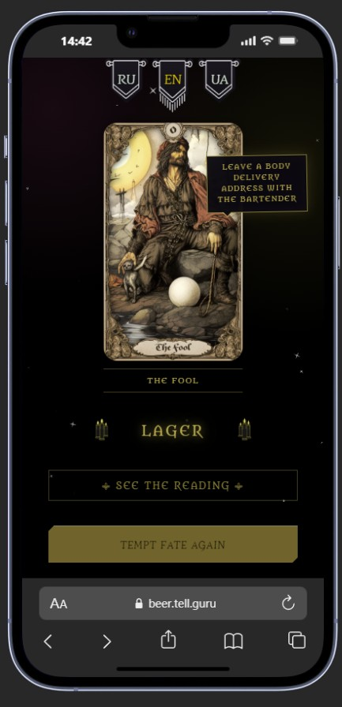
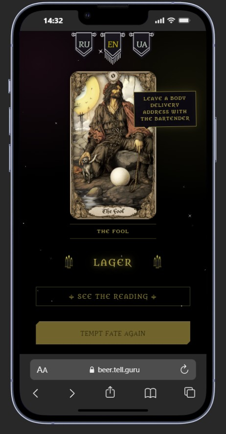

# 🍺 Pull My Beer — Gothic Tarot × Craft Beer

> Live: **[beer.tell.guru](https://beer.tell.guru)** · 🤖 **[@pullmybeer_bot](https://t.me/pullmybeer_bot)** · 🐈‍⬛ a [Mnimi&Baldcat](https://baldcat.dev) product
>
> Draw a card, receive a darkly humorous **beer prophecy** shaped by your location, the weather, and the time of day.

> ℹ️ **Portfolio showcase.** This repository presents the architecture and selected
> engineering of a live product. It is **source-available, not open-source** — see
> [LICENSE](./LICENSE). The full working code, prompts, tuning and infrastructure are private.

---

## What is this?

A gothic tarot-meets-beer app across a **Telegram bot** and a **Vue 3 web app**, backed by one
**FastAPI** service. Each draw becomes an AI-written "beer prophecy" — and the reading is
**context-aware**: it weaves in where you are (IP geolocation), the **weather** there right now, and
the **time of day**, so a foggy Scottish evening and a sunny Bavarian noon get different prophecies.
Everything runs in **Docker behind Traefik**, with **Stripe** subscriptions shared across bot and web.

---

## Architecture

```mermaid
graph TD
    A[Internet] --> B["Traefik v3<br/>TLS · host/path routing"]

    B -->|beer.tell.guru| E["beer-nginx<br/>Vue 3 SPA"]
    B -->|apps.baldcat.dev/beerbot| C["beer-bot<br/>aiogram 3 · webhook"]
    B -->|apps.baldcat.dev/&#123;beer,auth,billing&#125;| D["beer-api · FastAPI"]

    E -->|Bearer JWT| D
    C -->|X-Internal-Token| D

    D --> F[("MongoDB 7<br/>Motor async")]
    D --> G["OpenAI<br/>GPT-4o-mini"]
    D --> W["WeatherAPI"]
    D --> P["ip-api.com<br/>geolocation"]
    D --> H["Stripe<br/>subscriptions"]
    D --> I["Resend<br/>magic-link email"]

    style B fill:#7F77DD,color:#fff
    style C fill:#1D9E75,color:#fff
    style D fill:#378ADD,color:#fff
    style E fill:#9B59B6,color:#fff
    style F fill:#639922,color:#fff
    style G fill:#D85A30,color:#fff
    style W fill:#2b7bba,color:#fff
    style P fill:#7a5230,color:#fff
    style H fill:#BA7517,color:#fff
    style I fill:#D4537E,color:#fff
```



---

## Tech Stack

### Backend


### Frontend


### Bot


### Infrastructure


---

## Services

| Service | URL | Description |
|---|---|---|
| `beer-api` | `apps.baldcat.dev/{beer,auth,billing}` | FastAPI — draws, auth, billing |
| `beer-bot` | `apps.baldcat.dev/beerbot` | Telegram bot (webhook) |
| `beer-nginx` | `beer.tell.guru` | Vue 3 SPA |
| `beer-mongo` | internal only | MongoDB (`traefik-private`) |
| `traefik` | — | Reverse proxy, TLS, routing |

---

## Engineering highlights

A few problems I found interesting to solve. Snippets below are **trimmed and sanitised** for
illustration — they are not the full implementation, and the AI prompts are not included.

### 🌍 Context-aware prophecy

The reading isn't generic — the prompt is assembled from **where the user is** (IP → country/city),
the **current weather** at those coordinates, and the **local time of day**. So the same card reads
differently on a rainy Tuesday morning in Glasgow than on a warm Friday night in Munich. Country
codes even carry UK subdivisions (`GB_SCT`, `GB_ENG`) for a little extra local flavour.

### 🧊 Stampede-guarded geolocation cache

Geo lookups hit a free third-party API, so they're cached 24h. Two details make it robust under
load: an **LRU+TTL** cache (evict oldest, not flush-all — a full flush caused a thundering herd
right after reset), and **in-flight de-duplication** so N concurrent requests for the same IP make
**one** upstream call, not N.

```python
async def get_geo_by_ip(ip: str) -> dict | None:
    hit, cached = _cache_get(ip, time.time())   # LRU: moves key to MRU on hit
    if hit:
        return cached

    # Someone else is already fetching this IP? Await their result instead of
    # firing a duplicate request (collapses a stampede into a single call).
    if ip in _INFLIGHT:
        return await _INFLIGHT[ip]

    fut = asyncio.get_running_loop().create_future()
    _INFLIGHT[ip] = fut
    try:
        result = await _lookup_upstream(ip)      # cache success AND failure (24h)
        return result
    finally:
        _INFLIGHT.pop(ip, None)
        fut.set_result(result)
```

### 🪪 One identity model, three kinds of session

Web visitors, paying web users, and Telegram users all resolve to the same `AuthUser`, distinguished
by a `kind` claim in a short-lived **JWT** (`anon` 24h, `telegram` 2h, `web` 7d). A single Stripe
subscription is linked across bot and web, so paying once unlocks both.

```python
def issue_token(kind: str, raw_id: str, subscribed: bool, ttl_hours: int):
    if kind not in ALLOWED_KINDS:            # {"anon", "telegram", "web"}
        raise ValueError(f"unknown kind: {kind}")
    payload = {
        "sub": f"{kind}:{raw_id}", "kind": kind, "raw_id": raw_id,
        "subscribed": bool(subscribed),
        "iat": _now(), "exp": _now() + ttl_hours * 3600,
    }
    return jwt.encode(payload, JWT_SECRET, algorithm="HS256")
```

### Other things worth a mention

- **Quota by user kind** — anonymous web 10/day, Telegram bot 3/day, subscribers unlimited; counted
  atomically in MongoDB to protect the OpenAI bill.
- **Trustworthy client IP** — `X-Forwarded-For` read from a trusted-hop count (never the spoofable
  left), IPv6 collapsed to `/64` so limits can't be dodged by cycling addresses.
- **Bot ↔ API isolation** — bot-only endpoints gated by a shared `X-Internal-Token` header.
- **Concurrent-draw guard** — an in-memory lock stops a double-tap from spending two draws.
- **Easter eggs** — special date/condition triggers tweak the prophecy for a wink.

---

## Security

- **JWT** sessions (HS256), short TTLs per kind, strict claim validation on every request.
- Rate limiting keyed on the **real** client IP (trusted-hop `X-Forwarded-For`, IPv6 `/64`).
- Per-kind **daily quota** to stop token-draining abuse of the AI endpoint.
- **Internal-token isolation** for bot-only endpoints (fail-closed).
- Passwordless **magic-link** web sign-in (Resend), Stripe webhook signature verification.
- MongoDB on an internal-only Docker network; secrets via env, never committed.

---

## Screenshots


| Web app | Telegram bot | A prophecy |
|---|---|---|
|  |  |  |

---

## Related

- 🍺 [beer.tell.guru](https://beer.tell.guru) — web app
- 🤖 [@pullmybeer_bot](https://t.me/pullmybeer_bot) — Telegram bot
